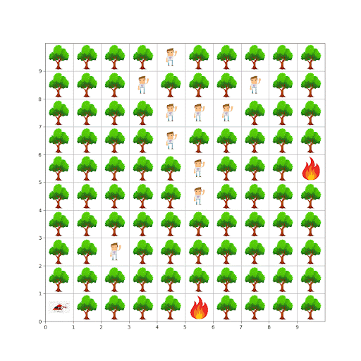
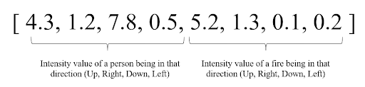
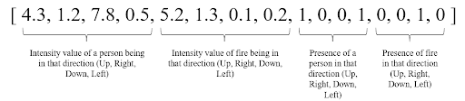
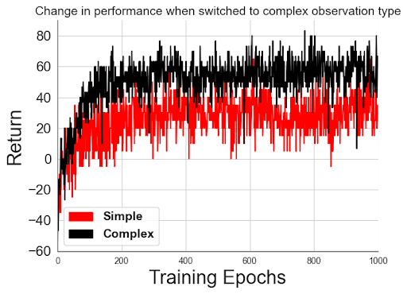
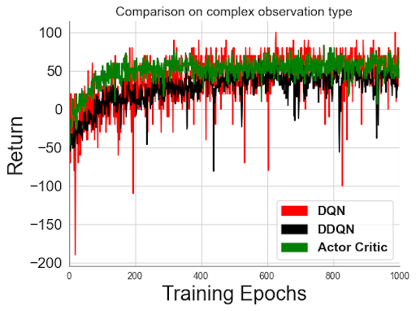
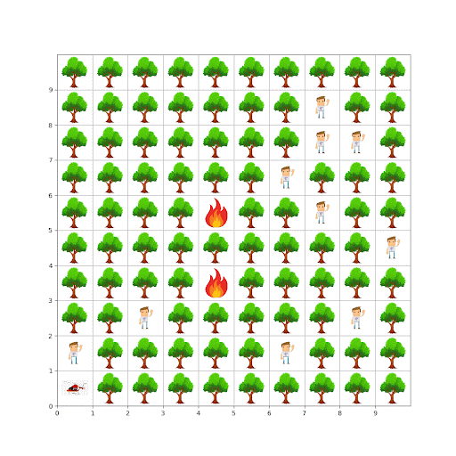
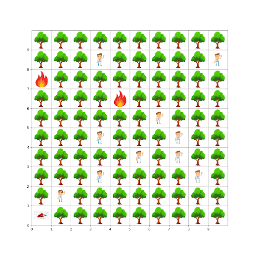
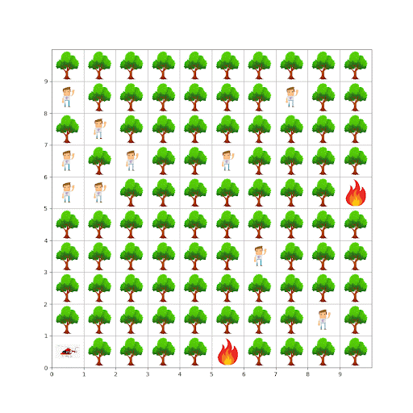

# CSE546FinalProject
### Final project for CSE546 Reinforcement Learning: Training a RL agent to rescue people in a forest fire

## Environment Definitions
### Actions
The agent will have four actions available:
- Move Left
- Move Right
- Move Down
- Move Up

### States
The environment will be a gridworld where a cell can contain:
- Nothing
- The Agent
- Fire
- A Person in Need of Rescue

At each time step, the fire will have a chance to spread to neighboring cells. This is done by maintaining a seperate matrix containing the 'heat' values at the corresponding location in the grid environment. Once these values reach a certain threshold, that cell will engulf in flames.

If a cell containing a person sets fire, the person is elimanted from the environment.

The number of people in a grid will be calculated depending on the size of the grid.

### Observations
We have two different observation types, both of which are made to keep the agent generalizable across different grid sizes as well as people and fire spawning positions.

#### Simple Observation
At each step, the agent will get a vector of length 8. The first four values in the vector, will be intensity values of how close a person is in the corresponding direction. The next four will be the intensity values of how close a fire is in that direction. These intensity values will be dependant on the number of people/fires in the corresponding direction.

#### Complex Observation
At each step, the agent will get a vector of length 16. The first eight values are the same as mentioned before in simple observation type. The last eight values are binary in nature which are added to give the agent a view of 4 adjacent cells in the grid where it can move to. The first four values are to tell if a person is present in that direction. The last four values are to tell if a fire is present in that direction.

### The Agent
The Agent's goal is to pick up all of the people before the fire eliminates them and keep itself away from the fire. When the agent lands on a cell that contains a person, it will automatically pick them up.

### Termination
The episode will terminate if the agent traverses onto a cell that contains fire or if there is no one left to save in the grid.

### Rewards
The agent gets a reward of +10 for picking up a person and -10 if it goes to a cell containing fire or tries to leave the grid.

## Reinforcement Learning Algorithms Used
The following three algorithms were used to train the agent:
- Deep Q-Network
- Double Deep Q-Network
- TD Advantage Actor Critic (A2C)

## Comparisons
### Comparison between simple and complex observation learning

### Comparison between different algorithms

## Visualizations for trained agent
Saving 9 people

Saving 8 people

Saving 7 people
